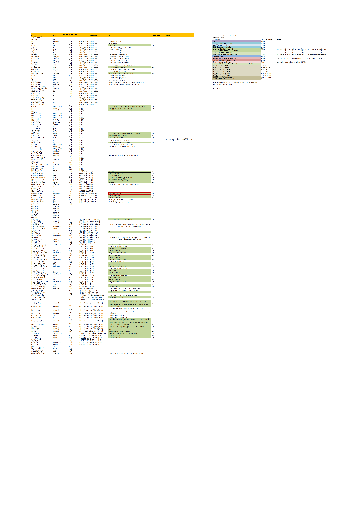
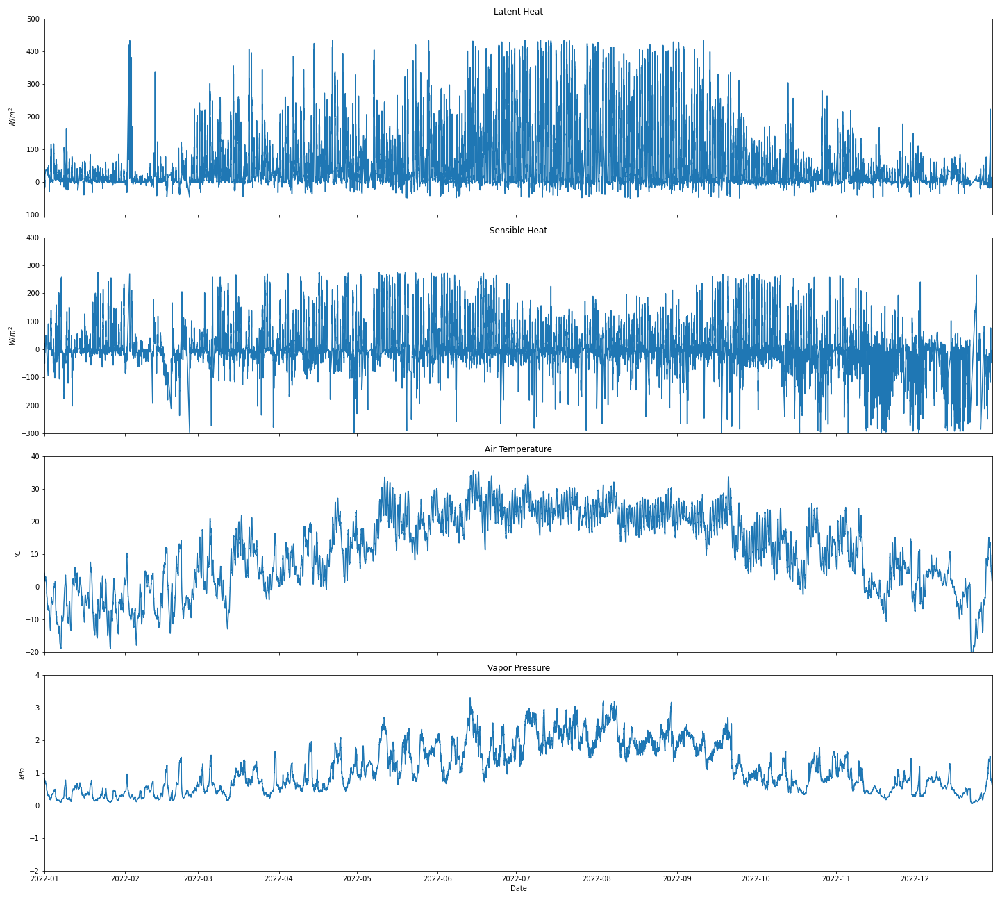

# Dataset Description{.page_break_before}

We propose to use Goose Creek Eddy Covariance Flux Tower Sensor Data[@kumar2024]. The data is collected from the Eddy Covariance Flux Tower in Goose Creek, Piatt County. The dataset consists of time series data spanning from Spring 2016 to Spring 2023 with 15 minutes time interval. Dataset involves 167 variables shown in Figure @fig: Data including latent heat, sensible heat, wind speed, temperature, and changes in the ecosystem with respect to water, carbon, and temperature. Figure 2 illustrates part of variables in 2022. The data collected by flux tower provides a foundation for further investigation into hydrological, meteorological, and environmental phenomena. The format of dataset is CSV file (generated from raw PICKLE file). The dataset can be found through link: <https://www.hydroshare.org/resource/c276c71e8d1246e29d8502f5b2054668/>

{width=80%}
{#fig:Data width=100%}
{width=80%}

# Proposal

## Background

Evapotranspiration (ET) is the process of water transferring from land to the atmosphere, accompanying the phase change of water from liquid to gas. This process plays a critical role in the ecohydrological system and profoundly affects the hydrological cycle. The processes of evapotranspiration and energy exchange are interdependent. Both latent heat (LE) and evapotranspiration (ET), from the perspective of energy and water flux, are key terms for anticipating weather conditions, simulating climate, and diagnosing climate change. However, the measurement of evapotranspiration is challenging because the process itself is invisible and complex.

Figure 3 shows the latent heat data gap in 2020 due to covid-19 and overhaul of equipment. Our project goal is to fill in these missing data. The ground truth data is collected from satelite sensors (<https://etdata.org/>). Despite the existence of numerous classical evapotranspiration simulation models, such as Bowen Ratio, Priestley-Taylor and Penman-Monteith models, the predictive accuracy of these models is inferior to that of deep learning models. Therefore, we plan to use RNN and LSTM deep learning models to predict latent heat and fill the gap.
{width=80%}

## Step 1: Regression analysis

We have 167 variables in the dataset. Although we can filter some ET related variables based on empirical models, these variables may not accurate and AI models tend to obtain adequate information. Therefore, we propose to conduct regression analysis to find out variables highly correlated to latent heat. These variables will be input variables in deep learning model.

## Step 2: Deep Learning Time Series Forecast (Time Series Imputation)

Once we confirm the input variables, we plan to use RNN or LSTM forecast models to predict latent heat in 2020. All the input are divided into training datasets and the validation datasets. After the RNN model is trained, the validation datasets are used to verify the model. At last, the missing data are generated by the model.  

[Source](https://www.hydroshare.org/resource/c276c71e8d1246e29d8502f5b2054668/)
