# Introduction
The greenhouse effect is becoming more severe due to climate change, leading to increased water scarcity as rising temperatures speed up evapotranspiration. This process transfers water from the land to the atmosphere, putting more pressure on water resources.[1],[2] Evapotranspiration (ET) is not only a key part of moving water but also plays an important role in energy exchange and climate regulation.[3] At the center of this process is latent heat flux (LE), which represents the energy used during evapotranspiration. LE serves as a bridge between the water and energy cycles, affecting precipitation, soil moisture, and plant health.[4] It also provides important data for climate models and helps us better understand ecosystems, making it essential in environmental research.[5]

Despite its importance, accurately measuring latent heat flux is challenging due to frequent data gaps caused by sensor failures, maintenance issues, or external disruptions, such as those experienced during the COVID-19 pandemic in 2020.[6] To address these gaps, researchers have traditionally used physical models such as the Bowen Ratio method, the Priestley-Taylor model, and the Penman-Monteith equation. These models rely on established physical principles and have advanced our understanding of ET. However, they face notable limitations, including difficulty capturing non-linear relationships between variables and reliance on extensive parameter calibration. As a result, their predictive performance is often limited when applied to complex, real-world datasets.

Recent advancements in machine learning offer a promising alternative for addressing these challenges. Deep learning models, particularly Recurrent Neural Networks (RNNs) and Long Short-Term Memory (LSTM) networks, are highly effective in analyzing time-series data.[7],[8] These models excel at capturing temporal dependencies and non-linear interactions, making them ideal for predicting latent heat flux. Additionally, they can fill data gaps caused by equipment downtime while leveraging environmental variables such as air temperature, net radiation, soil moisture, and wind speed to provide robust and accurate predictions.[9]

This study aims to harness the capabilities of deep learning to improve the prediction of latent heat flux and address data gaps in a high-resolution dataset collected from the Goose Creek Eddy Covariance Flux Tower (2016–2023). By focusing on missing data from 2020 caused by equipment maintenance and the COVID-19 pandemic, the research seeks to restore data continuity and enhance our understanding of the underlying dynamics of the ecosystem.

The contributions of this study are threefold. First, it will improve the accuracy and completeness of latent heat flux data, supporting better predictions of regional water and energy balances. Second, the findings will inform the calibration of global climate models, enabling more reliable simulations of climate variability and change. Finally, by demonstrating the application of deep learning in hydrology and environmental science, this work highlights its potential to address complex, data-intensive challenges.

# Exploratory analysis
For this study, we utilized a rich dataset derived from the Goose Creek Eddy Covariance Flux Tower, covering the period from Spring 2016 to Spring 2023. This dataset, consisting of 167 variables recorded at 15-minute intervals, provides comprehensive insights into various environmental parameters such as latent heat flux (LE_Obs), net radiation (Rn), air temperature (T), relative humidity, and air pressure. These variables are pivotal for understanding the energy and water exchanges within the ecohydrological system, making the dataset particularly relevant for studying latent heat flux and evapotranspiration processes.

{width=80%}

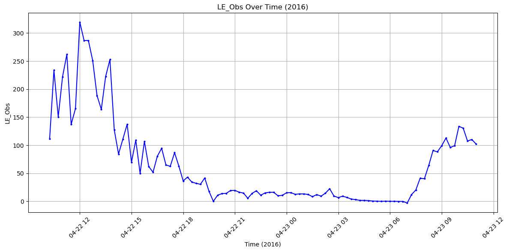{width=80%}

The dataset not only captures key energy balance components but also reflects the temporal dynamics of environmental variables. For example, latent heat flux demonstrates pronounced seasonal trends and is influenced by factors such as net radiation and temperature. However, the dataset contains data gaps, such as those in 2020 due to equipment overhauls and the COVID-19 pandemic. These gaps underscore the importance of robust imputation techniques to ensure the dataset's continuity and reliability for downstream analyses.

Our exploratory analysis involved identifying the variables most correlated with latent heat flux to narrow down the dataset to the most influential predictors. Variables such as net radiation (Rn), temperature (T), sensible heat flux, and relative humidity were selected based on their theoretical and empirical relationships with latent heat. Summary statistics and visualizations revealed key patterns, such as the strong positive correlation between latent heat flux and net radiation. These findings guided the selection of features for our predictive modeling.

By understanding the characteristics and interactions of the dataset, we aimed to address the central research question: how to accurately predict latent heat flux during periods with missing data. This step laid the groundwork for designing machine learning models capable of capturing complex temporal dependencies and improving the overall accuracy of predictions.

# Predictive modeling
Predictive modeling for this study employed a range of techniques to estimate latent heat flux (LE_Obs) from the Goose Creek dataset. The methods included regression (basic and normalized), PCA regression, single and multi-layer neural networks, convolutional neural networks (CNNs), and long short-term memory (LSTM) networks. Each method was evaluated using metrics such as Mean Squared Error (MSE), Root Mean Squared Error (RMSE), and R-squared to assess their performance.

## Regression analysis
•	Basic Regression: A linear regression model was trained without preprocessing the input data. The model captured the general seasonal variation of latent heat flux, but significant biases persisted between the observed and simulated values. While the R-squared value exceeded 70%, the MSE and RMSE values remained high, highlighting the model's limitations in accuracy (Figures 4–7).

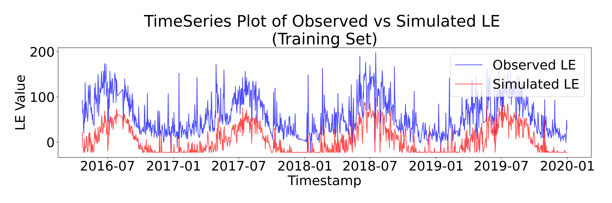{width=80%}

{width=80%}

{width=80%}

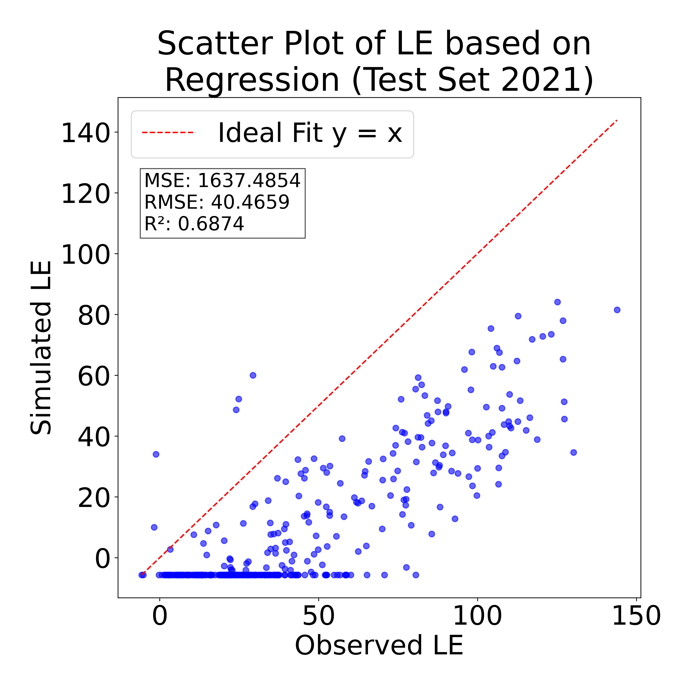{width=80%}

•	Normalized Regression: To mitigate biases, the input data was normalized to a 0–1 range before regression. This adjustment improved error metrics significantly, reducing the MSE from 3524 to 530 and the RMSE to 23. This model effectively preserved the observed trends and provided better predictions, as seen in Figures 8–11.

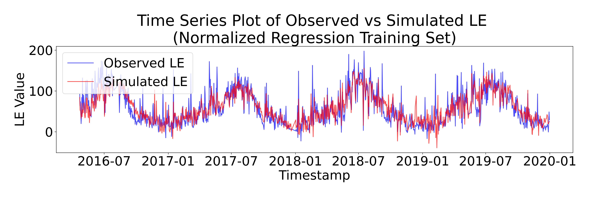{width=80%}

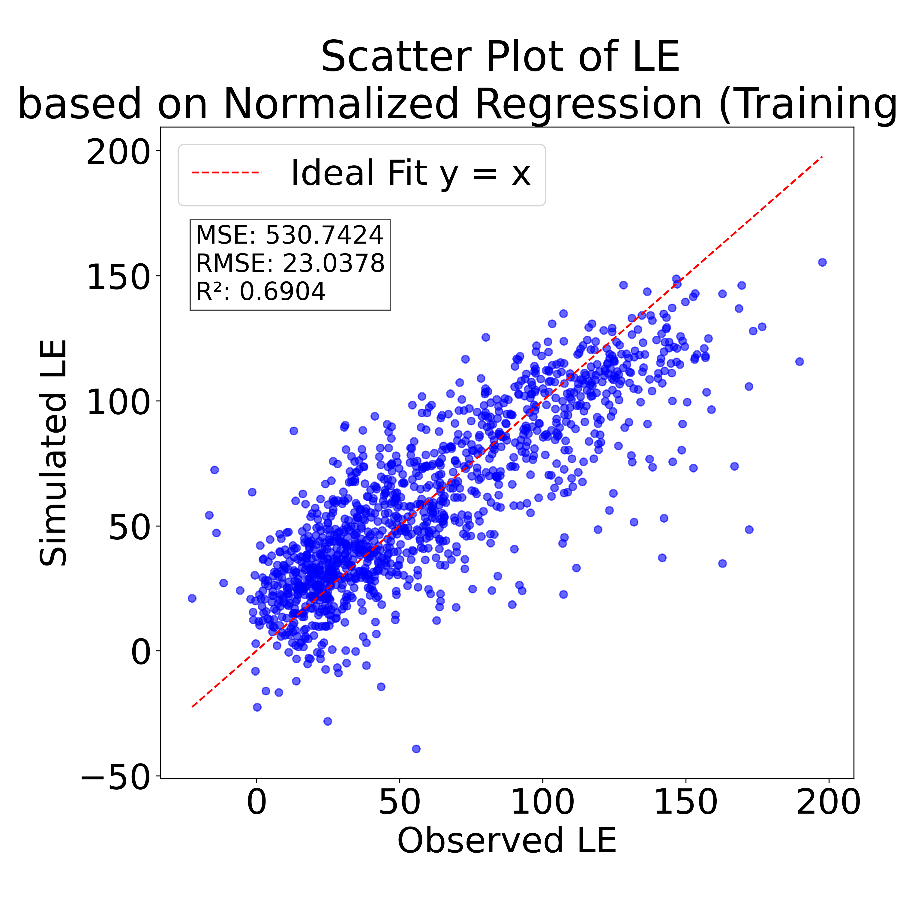{width=80%}

{width=80%}

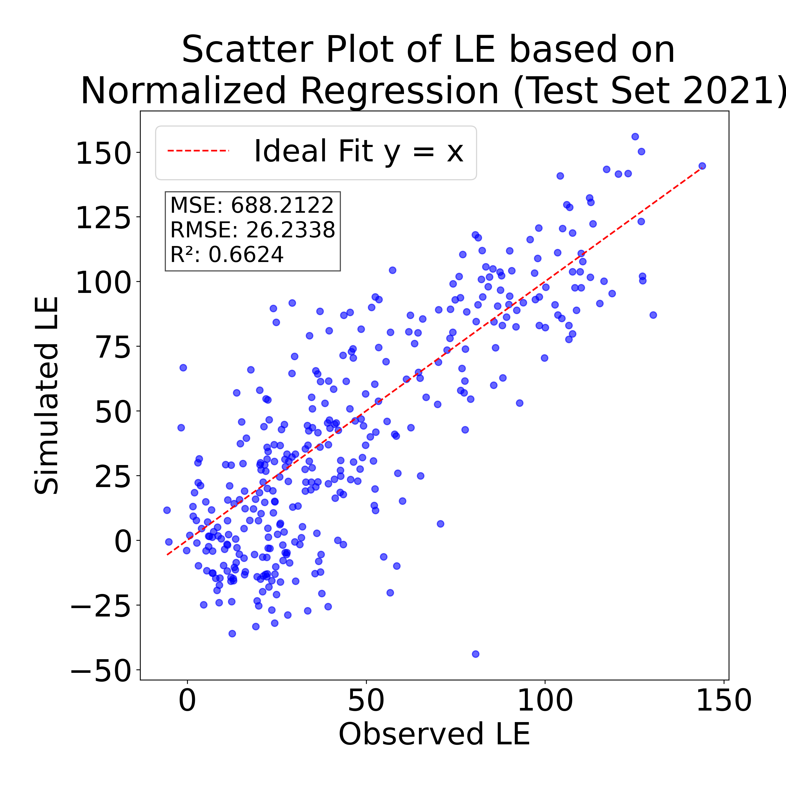{width=80%}

•	PCA Regression: To enhance generalization, principal component analysis (PCA) was used to derive three dominant components for regression. While this approach captured broad trends, it struggled to predict extreme values, and performance on the test set was poor due to inconsistencies in PCA across training and test datasets (Figures 12–15). A combined PCA regression improved results marginally but retained significant limitations (Figures 16–19).

{width=80%}

{width=80%}

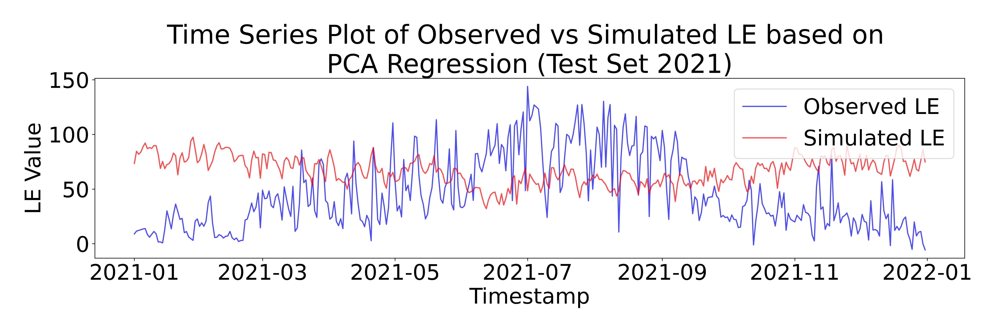{width=80%}

{width=80%}

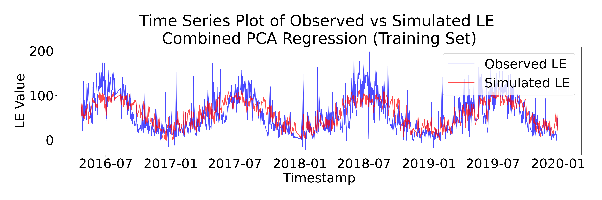{width=80%}

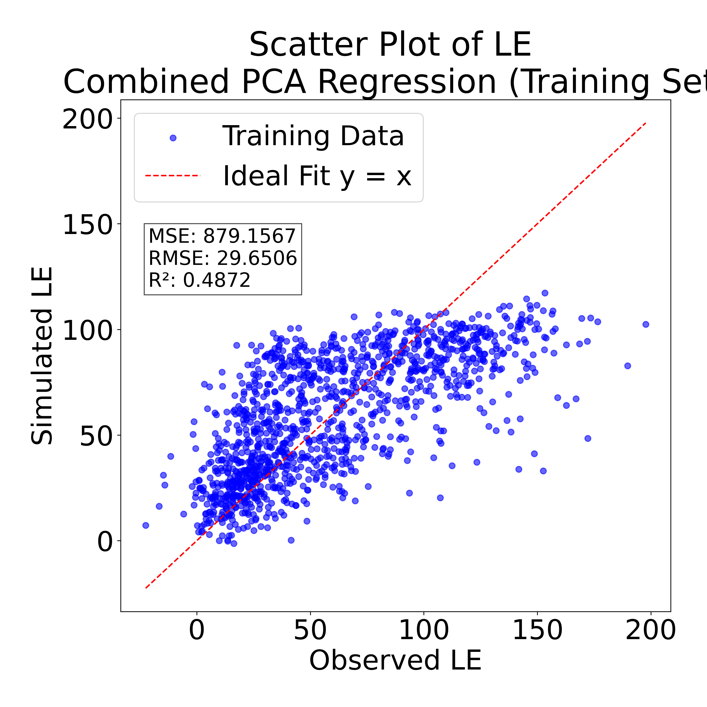{width=80%}

{width=80%}

{width=80%}

## Neural network models
•	Single-Layer Neural Network: This network, with a single hidden layer, demonstrated improved predictive performance over regression models. It captured more complex patterns in the data, achieving an R-squared value of 67% and reduced error metrics (Figures 20–23).

{width=80%}

{width=80%}

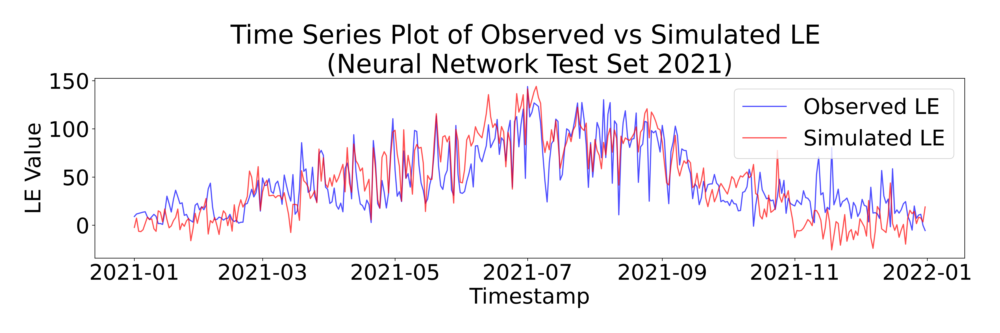{width=80%}

{width=80%}

•	Multi-Layer Neural Networks: Networks with multiple layers (e.g., double and quadra layers) exhibited better accuracy in the training set, with R-squared values exceeding 80%. However, these models faced overfitting issues, leading to poor performance on the test set, especially for the quadra-layer network.

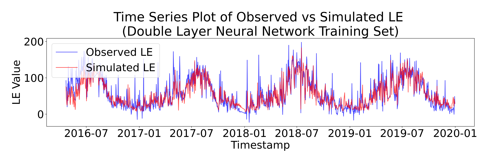{width=80%}

{width=80%}

{width=80%}

{width=80%}

{width=80%}

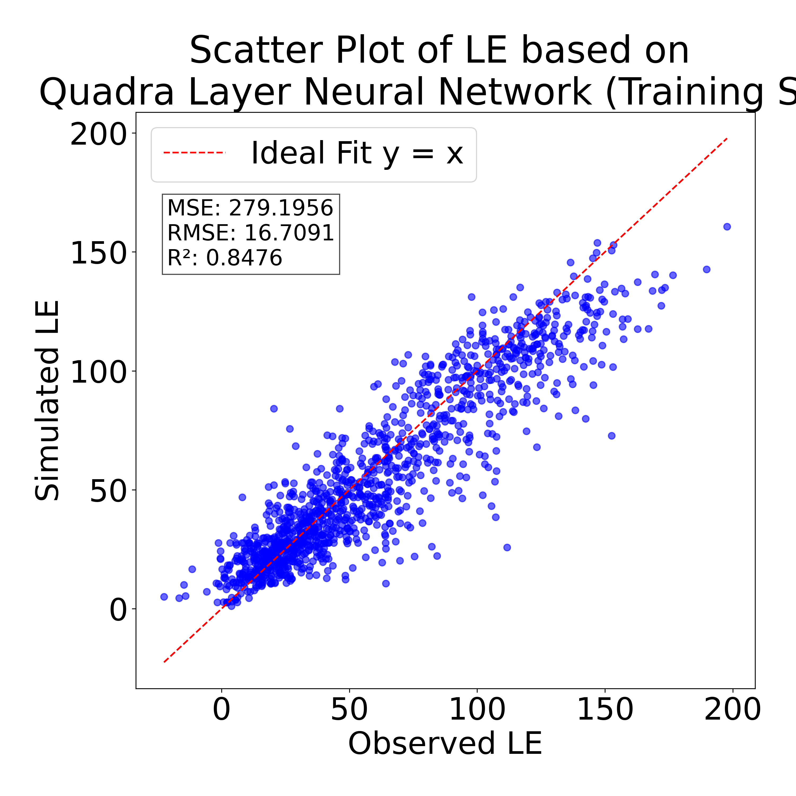{width=80%}

{width=80%}

{width=80%}

## Advanced models
•	Convolutional Neural Networks (CNNs): Although CNNs are primarily used for image data, they were adapted for time-series prediction. While they did not outperform the neural networks in accuracy, they exhibited superior generalization on the test set (Figures 26–29).

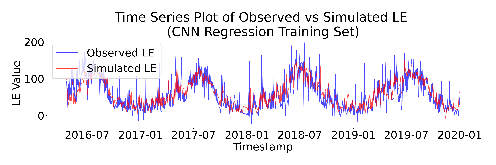{width=80%}

{width=80%}

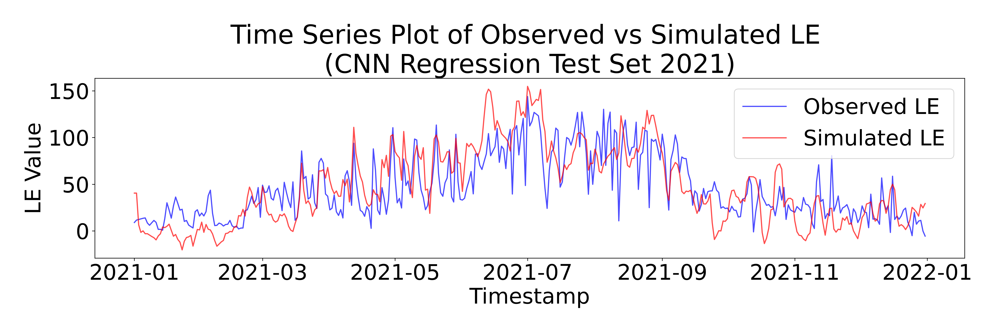{width=80%}

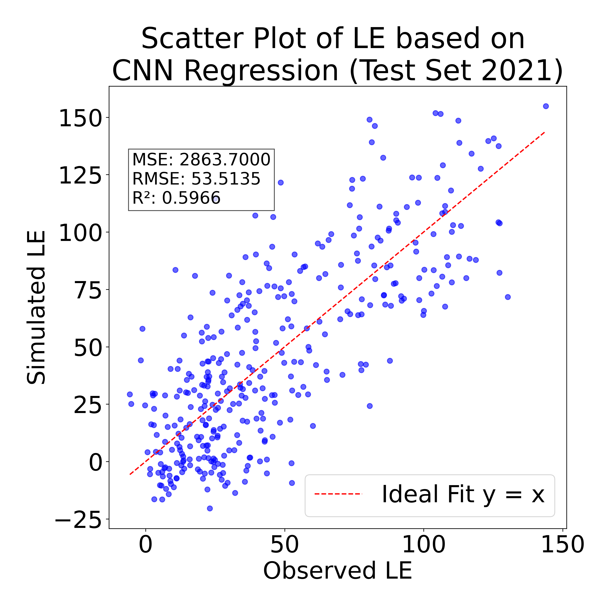{width=80%}

•	LSTM Networks: LSTM networks were the most effective for capturing sequential dependencies in the data. These models outperformed other methods in both training and test sets, demonstrating their suitability for time-series forecasting. Figures and metrics related to LSTM models (not included here) showed substantial improvements in MSE and R-squared.

{width=80%}

The analysis revealed that data preprocessing, including normalization, significantly enhanced model performance. While neural networks and LSTM models provided the most accurate predictions, overfitting remained a challenge for deeper networks. Future work should focus on hyperparameter tuning and integrating additional environmental data to improve model generalization and robustness.

# Discussion
This study aimed to address the research question: Can machine learning models effectively predict latent heat flux (LE_Obs) during periods with missing data using environmental variables as inputs? The analysis demonstrated that it is indeed possible to fill data gaps and predict latent heat flux with reasonable accuracy, supporting the hypothesis that advanced machine learning models, particularly LSTM networks, outperform traditional regression methods in capturing the complexities of time-series data.

## Were the Research Question and Hypothesis Addressed?
The findings confirmed that LSTM models were the most effective, leveraging their ability to capture temporal dependencies in the data. Neural networks and normalized regression also provided reasonable predictions, but the LSTM achieved the best overall performance. Regression methods, especially when unprocessed, struggled with bias and larger error metrics. Preprocessing through normalization significantly improved these models, though they still fell short of deep learning approaches. Challenges and limitations were also observed: certain models, like PCA regression and quadra-layer neural networks, faced generalization issues or overfitting, which hindered their performance on the test set. While the models captured seasonal variations and trends in latent heat flux, difficulties in predicting extreme values persisted, particularly with regression and PCA-based methods. These findings support the hypothesis while highlighting areas for improvement.

## Next Steps
Future research should focus on refining the models and enhancing the input data to address the current limitations. For instance, LSTM architectures could be further optimized by fine-tuning hyperparameters, such as the number of layers, hidden units, and dropout rates, to reduce overfitting. Hybrid models combining CNNs and LSTMs could also be explored to better capture spatial and temporal dependencies. Expanding the dataset with additional environmental variables, such as soil moisture or vegetation indices, could provide more comprehensive input features. Furthermore, using domain knowledge to engineer features that capture interactions among variables, such as combined energy flux metrics, may improve predictive accuracy.

To increase robustness, the dataset could be augmented by incorporating data from other flux towers, enabling the model to generalize better across different environmental conditions. Data augmentation techniques could also be employed to synthetically generate missing values, particularly for critical periods like 2020. Additionally, conducting uncertainty analyses would help quantify the reliability of the models' predictions, making them more suitable for environmental decision-making and policy applications. Finally, the predictive framework developed in this study could be applied to broader contexts, such as forecasting evapotranspiration or diagnosing energy balance anomalies in other regions. By pursuing these directions, future work can build on the strong foundation established in this study to create more robust, accurate, and interpretable models for ecohydrological and climate science applications.

# References

[1]   UN-Water. Water and Climate Change. https://www.unwater.org/water-facts/water-and-climate-change (accessed Nov 19, 2024).

[2]   Earth Institute, Columbia University. How Climate Change Impacts Our Water. Columbia Climate School, September 23, 2019. https://news.climate.columbia.edu/2019/09/23/climate-change-impacts-water/ (accessed Nov 19, 2024).

[3]   Katul, G. G.; Oren, R.; Manzoni, S.; Higgins, C.; Parlange, M. B. Evapotranspiration: A Process Driving Mass Transport and Energy Exchange in the Soil-Plant-Atmosphere-Climate System. Rev. Geophys. 2012, 50 (3), RG3002. 

[4]   Novák, V. Evapotranspiration: A Component of the Water Cycle. In Evapotranspiration in the Soil-Plant-Atmosphere System; Progress in Soil Science; Springer: Dordrecht, 2012; pp 1–13.

[5]   Wild, M. The Global Energy Balance as Represented in CMIP6 Climate Models. Clim. Dyn. 2020, 55 (3), 553–577.

[6]   ET Data Portal. Evapotranspiration Data from Satellite Sensors. ETdata.org. https://etdata.org/ (accessed Nov 20, 2024).

[7]   Guo, X.; Yao, Y.; Tang, Q.; Liang, S.; Shao, C.; Fisher, J. B.; Chen, J.; Jia, K.; Zhang, X.; Shang, K.; Yang, J.; Yu, R.; Xie, Z.; Liu, L.; Ning, J.; Zhang, L. Multimodel Ensemble Estimation of Landsat-like Global Terrestrial Latent Heat Flux Using a Generalized Deep CNN-LSTM Integration Algorithm. Agric. For. Meteorol. 2024, 349, 109962.

[8]   Mienye, I. D.; Swart, T. G.; Obaido, G. Recurrent Neural Networks: A Comprehensive Review of Architectures, Variants, and Applications. Information 2024, 15 (9), 517.

[9]   Khan, M. S.; Jeon, S. B.; Jeong, M.-H. Gap-Filling Eddy Covariance Latent Heat Flux: Inter-Comparison of Four Machine Learning Model Predictions and Uncertainties in Forest Ecosystem. Remote Sens. 2021, 13 (24), 4976. DOI: 10.3390/rs13244976.

# Appendix (Previous PRJ)

# Dataset Description{.page_break_before}

We propose to use Goose Creek Eddy Covariance Flux Tower Sensor Data(Kumar & Sargent, 2024). The data is collected from the Eddy Covariance Flux Tower in Goose Creek, Piatt County. The dataset consists of time series data spanning from Spring 2016 to Spring 2023 with 15 minutes time interval. Dataset involves 167 variables shown in Table 1 including latent heat, sensible heat, wind speed, temperature, and changes in the ecosystem with respect to water, carbon, and temperature. Figure 1 illustrates part of variables in 2022. The data collected by flux tower provides a foundation for further investigation into hydrological, meteorological, and environmental phenomena. The format of dataset is CSV file (generated from raw PICKLE file). The dataset can be found through link: <https://www.hydroshare.org/resource/c276c71e8d1246e29d8502f5b2054668/>

{width=80%}

| Variable Name       | Units                        | Description                                                                                       |
|:-------------------:|:----------------------------:|:-------------------------------------------------------------------------------------------------:|
| TIMESTAMP           | $TS$           |                                                                                                 |
| RECORD              | $RN$          |                                                                                                 |
| Hs                  | $W/m^2$        | sensible heat flux                                                                              |
| tau                 | $kg/(m \cdot s^2)$ | shear stress                                                                                    |
| u_star              | $m/s$          | friction velocity                                                                               |
| Ts_stdev            | $^\circ C$            | instantaneous stdev of temperature                                                             |
| Ts_Ux_cov           | $^\circ C \cdot m/s$        | inst. cov(temp, Ux)                                                                             |
| Ts_Uy_cov           | $^\circ C \cdot m/s$        | inst. cov(temp, Uy)                                                                             |
| Ts_Uz_cov           | $^\circ C \cdot m/s$        | inst. cov(temp, Uv)                                                                             |
| Ux_stdev            | $m/s$ | instantaneous stdev of Ux                                                                       |
| Ux_Uy_cov           | $(m/s)^2$ | instantaneous cov of (Ux, Uy)                                                                    |
| Ux_Uz_cov           | $(m/s)^2$ | instantaneous cov of (Ux, Uz)                                                                    |
| Uy_stdev            | $m/s$          | instantaneous stdev of Uy                                                                       |
| Uy_Uz_cov           | $(m/s)^2$      | instantaneous cov of (Uy, Uz)                                                                    |
| Uz_stdev            | $m/s$          | instantaneous stdev of Uz                                                                       |
| wnd_spd             | $m/s$          | wind speed (horizontal) - different from next?                                                  |
| rslt_wnd_spd        | $m/s$          | wind speed (horizontal)                                                                         |
| wnd_dir_sonic       | $degrees$      | wind direction from CSAT3, deg from N?                                                          |
| std_wnd_dir         | $degrees$      | inst. stdev of wind direction                                                                   |
| wnd_dir_compass     | $degrees$      | wind direction from compass (from N?)                                                           |
| Ux_Avg              | $m/s$          | average horiz windspeed x                                                                       |
| Uy_Avg              | $m/s$          | average horiz windspeed y                                                                       |
| Uz_Avg              | $m/s$          | average vertical windspeed z                                                                    |
| Ts_Avg              | $^\circ C$  | air temperature at 25 m                                                                         |
| sonic_azimuth       | $degrees$      | 180 is direction is pointing - can change this value                                            |
| sonic_samples_Tot   | samples      | 10 Hz sampling rate (cycles per 15 mins = 9000)                                                 |
| Fc_li_wpl           | $mg/(m^2 \cdot s)$   | carbon flux upward (+ = upward) with Webb et al Term                                            |
| LE_li_wpl           | $W/m^2$        | latent heat flux with Webb et al term                                                           |
| Hc_li               | $W/m^2$        | sensible heat flux                                                                              |
| CO2_li_mean         | $mg/m^3$       | CO2 conc --> need to convert to ppm units                                                       |
| H2O_li_mean         | $g/m^3$        | water vapor conc at 25 m                                                                        |
| amb_press_li_mean   | $kPa$          | air pressure at 25 m                                                                            |
| Tc_li_mean          | $^\circ C$            | CSAT air temperature at 25 m                                                                    |
| rho_a_li_mean       | $kg/m^3$       | density of air with water vapor                                                                 |
| Fc_li_irga          | $mg/(m^2 \cdot s)$   | carbon flux without Webb et al. Term                                                            |
| LE_li_irga          | $W/m^2$        | latent heat flux without Webb et al. Term                                                       |
| irga_li_samples_Tot | $samples$      | should be around 60 - quality indicator of LiCor                                                |
| Precip_Tot          | $mm$           | rainfall                                                                                        |
| T_tmpr_rh_mean      | $^\circ C$            | air temperature at 25 m                                                                         |
| e_tmpr_rh_mean      | $kPa$          | vapor pressure at 25 m                                                                          |
| e_sat_tmpr_rh_mean  | $kPa$          | saturated vapor pressure at 25 m                                                                |
| H2O_tmpr_rh_mean    | $g/m^3$        | water vapor conc at 25 m                                                                        |
| RH_tmpr_rh_mean     | $%$            | Relative Humidity at 25 m (e/e_sat)                                                             |
| rho_a_tmpr_rh_mean  | $kg/m^3$       | air density                                                                                     |
| slowsequence_1_Tot  | $samples$      | cycles per 15 mins - scanning every 10 secs                                                     |
| CS655_Wcr_Avg       | $m^3/m^3$      | soil water content                                                                              |
| CS655_Ec_Avg        | $dS/m$         | soil conductivity                                                                               |
| CS655_Tmpr_Avg      | $^\circ C$            | soil temperature                                                                                |
| mean_wind_speed     | $m/s$          | wind speed at 10 m height…not average?                                                          |
| mean_wind_direction | $degrees$      | wind direction                                                                                  |
| std_wind_dir        | $degrees$      | mean wind vector stdev of direction                                                             |
| NDVI_Avg            |              | Normalized Difference Vegetation Index                                                          |
| NDVIUpRed_Avg       | $W/m^2 \cdot nm$     | NDVI is calculated from upward and canopy facing sensors that measure IR and NIR radiation     |
| NDVIUpNIR_Avg       | $W/m^2 \cdot nm$     | NDVI is calculated from upward and canopy facing sensors that measure IR and NIR radiation     |
| NDVIIndUp           |              | NDVI is calculated from upward and canopy facing sensors that measure IR and NIR radiation      |
| NDVIDownRed_Avg     | $W/m^2 \cdot nm$     | NDVI is calculated from upward and canopy facing sensors that measure IR and NIR radiation     |
| NDVIDownNIR_Avg     | $W/m^2 \cdot nm$     | NDVI is calculated from upward and canopy facing sensors that measure IR and NIR radiation     |
| NDVIIndDown         |              | NDVI is calculated from upward and canopy facing sensors that measure IR and NIR radiation      |
| PRI_Avg             |              | Photochemical Reflectance Index                                                                 |
| PRIUp531_Avg        | $W/m^2 \cdot nm$     | PRI calculated from updward and canopy facing sensors that measure 2 wavelengths of radiation  |
| PRIUp570_Avg        | $W/m^2 \cdot nm$     | PRI calculated from updward and canopy facing sensors that measure 2 wavelengths of radiation  |
| PRIIndUp            |              | PRI calculated from updward and canopy facing sensors that measure 2 wavelengths of radiation   |
| PRIDown531_Avg      | $W/m^2 \cdot nm$     | PRI calculated from updward and canopy facing sensors that measure 2 wavelengths of radiation  |
| PRIDown570_Avg      | $W/m^2 \cdot nm$     | PRI calculated from updward and canopy facing sensors that measure 2 wavelengths of radiation  |
| PRIIndDown          |              | PRI calculated from updward and canopy facing sensors that measure 2 wavelengths of radiation   |
| D5TE_VWC_5cm_Avg    | $m^3/m^3$      | volumetric water content                                                                        |
| D5TE_P_5cm_Avg      |              | bulk dielectric permittivity                                                                    |
| D5TE_EC_5cm_Avg     | $dS/m$         | soil electrical conductivity                                                                    |
| D5TE_T_5cm_Avg      | $^\circ C$            | soil temperature                                                                                |
| D5TE_VWC_15cm_Avg   | $m^3/m^3$      | volumetric water content                                                                        |
| D5TE_P_15cm_Avg     |              | bulk dielectric permittivity                                                                    |
| D5TE_EC_15cm_Avg    | $dS/m$         | soil conductivity                                                                               |
| D5TE_T_15cm_Avg     | $^\circ C$            | soil temperature                                                                                |
| D5TE_VWC_30cm_Avg   | $m^3/m^3$      | volumetric water content                                                                        |
| D5TE_P_30cm_Avg     |              | bulk dielectric permittivity                                                                    |
| D5TE_EC_30cm_Avg    | $dS/m$         | soil conductivity                                                                               |
| D5TE_T_30cm_Avg     | $^\circ C$            | soil temperature                                                                                |
| D5TE_VWC_50cm_Avg   | $m^3/m^3$      | volumetric water content                                                                        |
| D5TE_P_50cm_Avg     |              | bulk dielectric permittivity                                                                    |
| D5TE_EC_50cm_Avg    | $dS/m$         | soil conductivity                                                                               |
| D5TE_T_50cm_Avg     | $^\circ C$            | soil temperature                                                                                |
| D5TE_VWC_100cm_Avg  | $m^3/m^3$      | volumetric water content                                                                        |
| D5TE_P_100cm_Avg    |              | bulk dielectric permittivity                                                                    |
| D5TE_EC_100cm_Avg   | $dS/m$         | soil conductivity                                                                               |
| D5TE_T_100cm_Avg    | $^\circ C$            | soil temperature                                                                                |
| D5TE_VWC_200cm_Avg  | $m^3/m^3$      | volumetric water content                                                                        |
| D5TE_P_200cm_Avg    |              | bulk dielectric permittivity                                                                    |
| D5TE_EC_200cm_Avg   | $dS/m$         | soil conductivity                                                                               |
| D5TE_T_200cm_Avg    | $^\circ C$            | soil temperature                                                                                |
| slowsequence_2_Tot  | $samples$      | cycles - 1 minute loops (number of times scanned)                                               |
| SB121TempC_Avg      | $^\circ C$            | SB = sensor body, temp of body of sensor                                                       |
| Targ121TempC_Avg    | $^\circ C$            | surface temperature                                                                            |
| Targ121mV_Avg       | $^\circ C$            |                                                                                                 |
| SB1H1TempC_Avg      | $^\circ C$            | SB = sensor body, temp of body of sensor                                                       |
| Targ1H1TempC_Avg    | $^\circ C$            | surface temperature                                                                            |
| Targ1H1mV_Avg       | $^\circ C$            |                                                                                                 |
| short_up_Avg        | $W/m^2$        | Incoming shortwave radiation detected by the upward facing instrument                           |
| short_dn_Avg        | $W/m^2$        | Outgoing shortwave radiation detected by the downward facing instrument                         |
| long_up_Avg         | $W/m^2$        | incoming longwave radiation detected by upward facing instrument                                |
| long_dn_Avg         | $W/m^2$        | outgoing longwave radiation detected by downward facing instrument                              |
| cnr4_T_C_Avg        | $^\circ C$            | temperature of sensor                                                                          |
| cnr4_T_K_Avg        | $K$           | temperature of sensor in Kelvin                                                                 |
| long_up_corr_Avg    | $W/m^2$        | Incoming longwave radiation detected by the upward facing instrument, corrected                 |
| long_dn_corr_Avg    | $W/m^2$        | Outgoing longwave radiation detected by the downward facing instrument, corrected               |
| Rs_net_Avg          | $W/m^2$        | Shortwave net radiation (Rshort_up - Rshort_down)                                               |
| Rl_net_Avg          | $W/m^2$        | Longwave net radiation (Rlong_up - Rlong_down)                                                 |
| albedo_Avg          | $W/m^2$        | Albedo                                                                                          |
| Rn_Avg              | $W/m^2$        | Net radiation (Rs_net + Rl_net)                                                                 |
| SQ_110_Avg          | $\mu \mathrm{mol}$ photons $/(m^2 \cdot s)$| PAR (photosynthetically active radiation)                                  |
| shf_Avg(1)          | $W/m^2$        | Ground heat flux                                                                                |
| shf_Avg(2)          | $W/m^2$        | Ground heat flux                                                                                |
| slowsequence_3_Tot  | $samples$      | number of times scanned in 15 mins (once per min)                                               |

Table: A table with a variables.
{#tbl:bowling-scores}

# Proposal

## Background

Evapotranspiration (ET) is the process of water transferring from land to the atmosphere, accompanying the phase change of water from liquid to gas. This process plays a critical role in the ecohydrological system and profoundly affects the hydrological cycle. The processes of evapotranspiration and energy exchange are interdependent. Both latent heat (LE) and evapotranspiration (ET), from the perspective of energy and water flux, are key terms for anticipating weather conditions, simulating climate, and diagnosing climate change. However, the measurement of evapotranspiration is challenging because the process itself is invisible and complex.

Figure 2 shows the latent heat data gap in 2020 due to covid-19 and overhaul of equipment. Our project goal is to fill in these missing data. The ground truth data is collected from satelite sensors (<https://etdata.org/>). Despite the existence of numerous classical evapotranspiration simulation models, such as Bowen Ratio, Priestley-Taylor and Penman-Monteith models, the predictive accuracy of these models is inferior to that of deep learning models. Therefore, we plan to use RNN and LSTM deep learning models to predict latent heat and fill the gap.

{width=80%}

## Step 1: Exploratory Data Analysis

We have 167 variables in the dataset. Although we can filter some ET related variables based on empirical models, these variables may not accurate and AI models tend to obtain adequate information. Therefore, we propose to conduct regression analysis to find out variables highly correlated to latent heat. These variables will be input variables in deep learning model. To simplify the process of figuring out how these factors interact and vary across different times of the day and seasons, we focus on the first five data of main variables first. The main variables include Timestamp, Observed latent heat flux (LE_Obs), Net radiation (Rn), Temperature in degrees Celsius (T), Air_Pressure and etc. Table 2 shows the first 5 data of each variable as follows:

## Step 2: Predictive Modeling (Deep Learning Time Series Forecast, Time Series Imputation)

Once we confirm the input variables, we plan to use RNN or LSTM forecast models to predict latent heat in 2020. All the input are divided into training datasets and the validation datasets. After the RNN model is trained, the validation datasets are used to verify the model. At last, the missing data are generated by the model.For Deliverable 3, the goal is to create a predictive model to estimate missing values or forecast future measurements, specifically targeting `LE_Obs` (Latent Heat Flux), due to its environmental relevance. The model plan includes:

1. **Problem Definition**: Use time-series forecasting to predict `LE_Obs` based on the past sequences of environmental variables. Predicting `LE_Obs` could help estimate latent heat flux in unmeasured periods, contributing to more complete energy balance data.
2. **Feature Selection**: Include variables closely related to `LE_Obs`, such as `Rn`, `T`, `Relative Humidity`, and `Sensible_H`. These will serve as predictive features as they capture the interactions of surface energy components.
3. **Model Choice**: Implement an LSTM (Long Short-Term Memory) model due to its suitability for time-series data, capturing sequential dependencies and trends. Using an LSTM allows the model to learn from past data sequences, making it appropriate for forecasting latent heat flux.
4. **Evaluation Metric**: Use Mean Squared Error (MSE) to evaluate the model’s performance, as it penalizes larger errors and is commonly used in regression tasks.
5. **Training Plan**: Divide the dataset into training, validation, and test sets, ensuring that the test set consists of the most recent data. Train the model on scaled data to improve performance and use the validation set for hyperparameter tuning.
  

{width=80%}

| Timestamp         | LE_Obs  | Rn       | T        | Air_Pressure | G         | VWC_30cm | VWC30cm_diff | Sensible_H | Relative_Humidity | Vapor_pressure | Saturated_Vapor_Pressure |
|-------------------|---------|----------|----------|--------------|-----------|----------|--------------|------------|-------------------|----------------|--------------------------|
| 2016/4/22 10:15   | 111.1646| 550.7244 | 15.39692 | 98.65031     | -3.305334 | 0.307    | NaN          | 66.62987   | 75.43023          | 1.318720       | 1.748264                  |
| 2016/4/22 10:30   | 233.7630| 566.5699 | 15.75987 | 98.67207     | -1.070949 | 0.307    | 0.0          | 97.43565   | 74.24434          | 1.328549       | 1.789427                  |
| 2016/4/22 10:45   | 150.6655| 568.7559 | 15.84722 | 98.69296     | 1.211160  | 0.307    | 0.0          | 74.73856   | 74.90156          | 1.347835       | 1.799476                  |
| 2016/4/22 11:00   | 222.2112| 631.6904 | 16.14020 | 98.71219     | 3.689381  | 0.307    | 0.0          | 89.94750   | 77.31715          | 1.417601       | 1.833488                  |
| 2016/4/22 11:15   | 261.9899| 704.8135 | 16.37151 | 98.72832     | 6.272957  | 0.307    | 0.0          | 99.07247   | 78.72035          | 1.464757       | 1.860709                  |
Table: Dataset
{#tbl:bowling-scores}

|                        | LE_Obs   | Rn       | T        | Air_Pressure | G        | VWC_30cm | VWC30cm_diff | Sensible_H | Relative_Humidity | Vapor_pressure | Saturated_Vapor_Pressure |
|------------------------|----------|----------|----------|--------------|----------|----------|--------------|------------|-------------------|----------------|--------------------------|
| **LE_Obs**              | 1.000000 | 0.740001 | 0.369080 | -0.066791    | 0.419244 | -0.023582| -0.037540    | 0.390064   | -0.288203         | 0.278373       | 0.425352                  |
| **Rn**                  | 0.740001 | 1.000000 | 0.354361 | 0.018251     | 0.412415 | -0.040560| -0.059480    | 0.642862   | -0.416080         | 0.198780       | 0.407578                  |
| **T**                   | 0.369080 | 0.354361 | 1.000000 | -0.365036    | 0.642930 | -0.166246| -0.001006    | 0.171602   | -0.262734         | 0.866856       | 0.959008                  |
| **Air_Pressure**        | -0.066791| 0.018251 | -0.365036| 1.000000     | -0.313725| -0.071028| -0.020830    | 0.103935   | -0.167686         | -0.348514      | -0.289969                 |
| **G**                   | 0.419244 | 0.412415 | 0.642930 | -0.313725    | 1.000000 | -0.024829| 0.058169     | 0.247713   | -0.382420         | 0.473200       | 0.689871                  |
| **VWC_30cm**            | -0.023582| -0.040560| -0.166246| -0.071028    | -0.024829| 1.000000 | -0.043053    | -0.074545  | 0.144828          | -0.110267      | -0.177017                 |
| **VWC30cm_diff**        | -0.037540| -0.059480| -0.001006| -0.020830    | 0.058169 | -0.043053| 1.000000     | -0.049210  | -0.000121         | -0.009242      | -0.003133                 |
| **Sensible_H**          | 0.390064 | 0.642862 | 0.171602 | 0.103935     | 0.247713 | -0.074545| -0.049210    | 1.000000   | -0.395557         | 0.011293       | 0.210560                  |
| **Relative_Humidity**   | -0.288203| -0.416080| -0.262734| -0.167686    | -0.382420| 0.144828 | -0.000121    | -0.395557  | 1.000000          | 0.149367       | -0.311806                 |
| **Vapor_pressure**      | 0.278373 | 0.198780 | 0.866856 | -0.348514    | 0.473200 | -0.110267| -0.009242    | 0.011293   | 0.149367          | 1.000000       | 0.863301                  |
| **Saturated_Vapor_Pressure** | 0.425352 | 0.407578 | 0.959008 | -0.289969 | 0.689871 | -0.177017| -0.003133    | 0.210560   | -0.311806         | 0.863301       | 1.000000                  |
Table: Correlation matrix
{#tbl:bowling-scores}

|                | LE_Obs      | Rn          | T           | Air_Pressure | G           | VWC_30cm   | VWC30cm_diff | Sensible_H | Relative_Humidity | Vapor_pressure | Saturated_Vapor_Pressure |
|----------------|-------------|-------------|-------------|--------------|-------------|------------|--------------|------------|-------------------|----------------|--------------------------|
| **mean**       | 53.976825   | 109.999297  | 12.524988   | 98.813399    | -0.159915   | 0.308942   | -0.000015    | 13.962563 | 71.872526         | 1.218452       | 1.783960                  |
| **std**        | 94.877870   | 227.819402  | 11.105505   | 0.670804     | 16.345332   | 0.033217   | 0.000257     | 72.768378 | 17.570532         | 0.743564       | 1.113461                  |
Table: Statistics of variables in the dataset
{#tbl:bowling-scores}

# Predictive Modeling

In this section, we propose to use Machine Learning methods to simulate target variable latent heat. Source variables are shown in the above table. Specifically, our methods include regression, single layer neural network, multi layer neural network, CNN network and LSTM. Figures and results are shown in following content including the scatter, time series plot, $R^2$, $MSE$ value between observed and simulated latent heat.

## Regression
### Basic Regression without processing

Based on gradient descent, we look for a vector $beta$ which can minimize the difference between simulated and observed value. Since our system has 9 source variables, we want to obtain a vector with 9 values which are the coefficient for each source variable. The equation is,

$L E=\beta_1 R n+\beta_2 T+\beta_3 P a+\beta_4 G+\beta_5 V W C+\beta_6 V W C diff +\beta_7 H+\beta_8 R H+\beta_9 V P$

At beginning, we didn't apply any processing on our data and we input the original data directly. Our learning rate is 0.001 and learning step is 10000 Figures 4 and 5 illustrate the scatter and time series plot for both observed and simulated latent heat. From these two figures, we can observe the regression method capture the correct seansonal variation of latent heat. However, the bias between two groups of data is obvious. The error metrics also reflect this phenomenon since R-squared value is over 70 percent which is great, but MSE and RMSE values are too large for the latent heat.

{width=80%}

{width=80%}

{width=80%}

{width=80%}

Based on the regression result, we obtain the following regression equation to obtain latent heat.

$$
LE = 35.2 R_n - 0.22 T - 3.95 P_a - 6.96 G + 4.03 VWC + 1.40 VWC diff - 14.39 H + 2.56 RH + 11.07 VP
$$

Overall, the regression equation is meaningful since LE has positive relationship with Rn and negative relationship with G and H based on the theoretical energy balance eqaution. In the regression equation, we can observe the positive coefficient for Rn and negative coefficient for G and H.

$L E=R_n-G-H$

### Normalized Regression
In order to solve the bias problem, we aim to conduct processing treatment on our original dataset. Thus, we normalize the data to conver the value from 0 to 1. Then we conduct same regression process as the basic regression section. The learning rate and steps are 0.05 and 10000 respectively. The predict result is shown in figures 6 and 7.

{width=80%}

{width=80%}

{width=80%}

{width=80%}

Based on these figures, we can see the prediction result is accurate. Simulated LE has the same variation and range as observed LE. According to error metrics, although R-squared value decreases from 71% to 69%, MSE and RMSE decreases significantly revealing a better result than basic regression. For the normalized regression model, we get the regression equation is

$$
LE = 189.29 \, R_n + 4.91 \, T - 15.69 \, Pa - 37.38 \, G + 29.35 \, \text{VWC} + 40.51 \, \text{VWC diff} - 122.88 \, H + 27.49 \, RH + 37.36 \, VP
$$

### PCA Regression
The last PCA regression model aims to slove the generalization difficulty. We conduct PCA analysis first to obtain three dominant component. Then we apply the regression analysis based on these three components. The learning steps and learning rate is 10000 and 0.001. Figure 9 illustrate PCA regression can obtain similar trend as observed latent heat value. However, the simulated model lack the ability to capture the extreme large and small value. Thus, the predictive performance is lower than previous normalized regression model based on the error metrics. In addition, we can find the accuracy in test set is very poor since we conduct PCA analysis seperately for test and training set. Thus, the principal components of the training and test sets are inconsistent which results in the poor predictive performance.

{width=80%}

{width=80%}

{width=80%}

{width=80%}

Therefore, we reanalysze the system by checking the PCA for training and testing set together. Figures 18 and 19 illustrate combined PCA regression has better performance than the seperated PCA regression.

{width=80%}

{width=80%}

{width=80%}

{width=80%}

## Neural Network
### Single Layer Neural Network
This section uses single layer neural network to predict latent heat. The learning steps and learning rate is 100000 and 0.01. Figures 20 and 21 demonstrate that involving contant value in model is better than previous regression models.

{width=80%}

{width=80%}

{width=80%}

{width=80%}

### Double Layer Neural Network
We continue to use deep layer neural network with double layer to predict latent heat. The learning steps and learning rate is 100000 and 0.01 same as previous network. The hidden size is 20 and the output size is 1. Figures 12 and 13 show double layer neural network has better predictive performance with R-squred value over 80% and RMSE value smaller than 20.

{width=80%}

{width=80%}

{width=80%}

{width=80%}

### Quadra Layer Neural Network
The quadra layer neural network has four layers of network with hidden size 20, 15, 10 and output size 1. The learning steps and rate is 100000 and 0.01 as well. Based on figures 26 and 27, we can see this network continue to improve the predictive performance. It has higher R-squared and lower RMSE value than double layer network. However, we also ovserved the generalization problem of this quadra layer neural network. It has very poor performance on test set with R-squared 48%.

{width=80%}

{width=80%}

{width=80%}

{width=80%}

### CNN
In this section, we plan to use CNN network to predict latent heat although CNN has better performance with image tasks. The CNN network involves Input Layer, 1D Convolutional Layer, ReLU Activation Function, Max Pooling Layer and Fully Connected Layer. Although it doesn't has better performance than previous neural network, it has better generalization ability since the predictive performance of test dataset is improved (Figures 27 and 29).

{width=80%}

{width=80%}

{width=80%}

{width=80%}

### LSTM
Finally, we are trying to use LSTM to predict latent heat.
{width=80%}

## References

Kumar, P., & Sargent, S. (2024). Goose Creek Eddy Covariance Flux Tower Sensor Data - Sep 2020-ongoing. HydroShare. http://www.hydroshare.org/resource/c276c71e8d1246e29d8502f5b2054668
